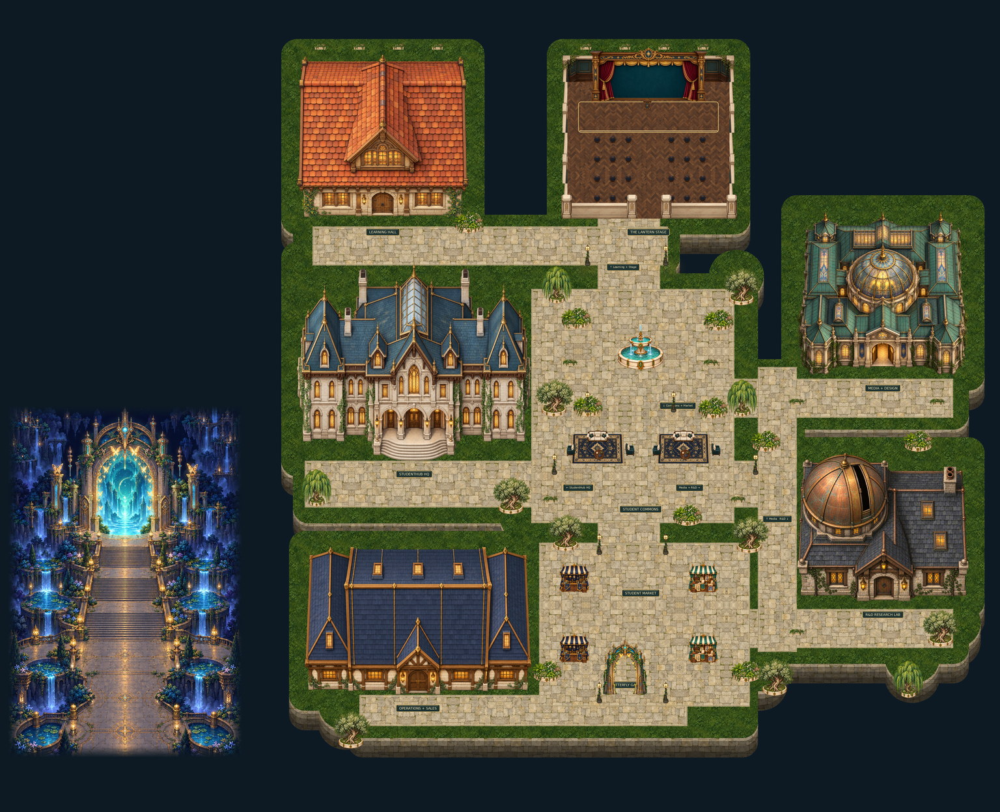

# Butterfly Campus · dark interior version

## Status

rejected-main-direction-preserved. Editable Tiled source and referenced assets are under `map/`. Keep the complete folder together when opening or copying it. Open `map/butterfly-campus.tmj` in Tiled. This folder is retained for future template selection and iteration. It is excluded from the published build.

## Source and evidence

Canonical snapshot: Butterfly-Campus-v3-Git-ready-map.zip, frozen rejected-dark revision. `template.json` records the map hash, screenshot, status and reuse limits; `SHA256SUMS.txt` checks every archived file. Screenshots are historical rendered evidence, not a claim of current live deployment.

## Known limitations

- Archived review candidate; not added to the live template catalog by this change.
- Historical source-harness evidence is not full Universe, current engine, multiplayer or physical-device acceptance.
- Imported static furniture does not imply movable editor entities or sitting behavior. Review native meetings, permissions, interactions and hosting before reuse.
- Dark interiors and furniture placement were not accepted for the main campus. Retained as an alternate template starting point.
- Historical return portal intersects the ordinary sales-to-fountain route; fix navigation before reuse.

## Reuse

Start from a copy of this folder. Keep the original snapshot unchanged, and create a new named folder for a revision. Re-test local asset references, collisions, entry/exit, avatar depth, conversation/audio behavior and engine compatibility before promoting it into the template catalog. Existing source art provenance and licenses remain with the map assets when available.
