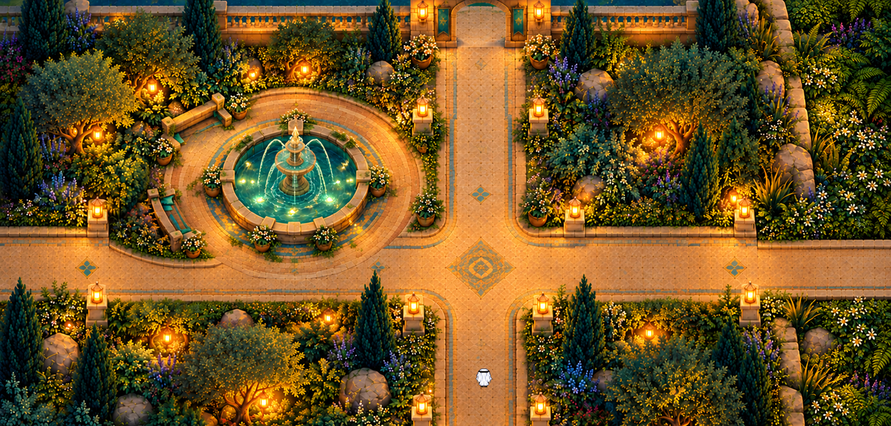

# Campus courtyard · connected fountain review 01

Status: **source-review-integration-unverified**. Not a deployed or catalog-ready map.

- Preserves original courtyard source, both generated master attempts, prompt/guide, semantic layers, module geometry and native review image.
- Standalone source review, not validated complete campus integration, multiplayer or functional route acceptance.
- Current office wall overlap and social-egress concerns remain unresolved by this courtyard art snapshot.

## Preserved sources

Editable project sources and representative evidence are under `source/`. Original file hashes are recorded in `template.json`; archived hashes are in `SHA256SUMS.txt`. Text-only machine-path normalization is listed in `ARCHIVE-CHANGES.json`. The screenshot and binary art are unchanged. Historical evidence is retained as evidence of the original bounded test, not proof that the complete campus or current runtime passes.

See [provenance](./PROVENANCE.md).
