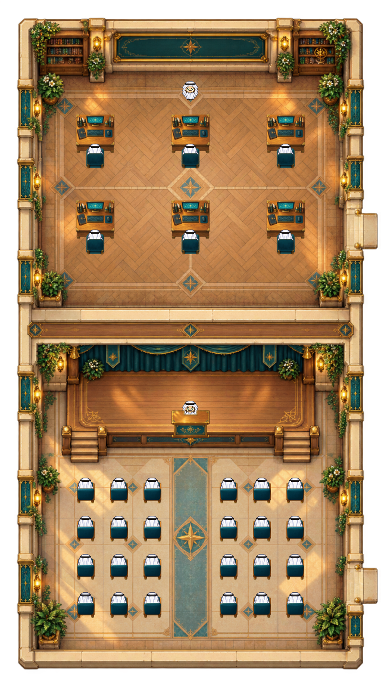

# Civic rooms · classroom and hall review 01

Status: **source-review-runtime-unverified**. Not a deployed or catalog-ready map.

- Original classroom and great-hall artwork, semantic layers, editable geometry, generation prompts and bounded QA source are preserved.
- Room composition is a review candidate; it is not live Universe, multiplayer, working conference audio or social-egress acceptance.
- Third-party Phaser and engine-derived primitive files retain their bundled licenses. No third-party reference-map artwork is included.

## Preserved sources

Editable project sources and representative evidence are under `source/`. Original file hashes are recorded in `template.json`; archived hashes are in `SHA256SUMS.txt`. Text-only machine-path normalization is listed in `ARCHIVE-CHANGES.json`. The screenshot and binary art are unchanged. Historical evidence is retained as evidence of the original bounded test, not proof that the complete campus or current runtime passes.

See [provenance](./PROVENANCE.md).
