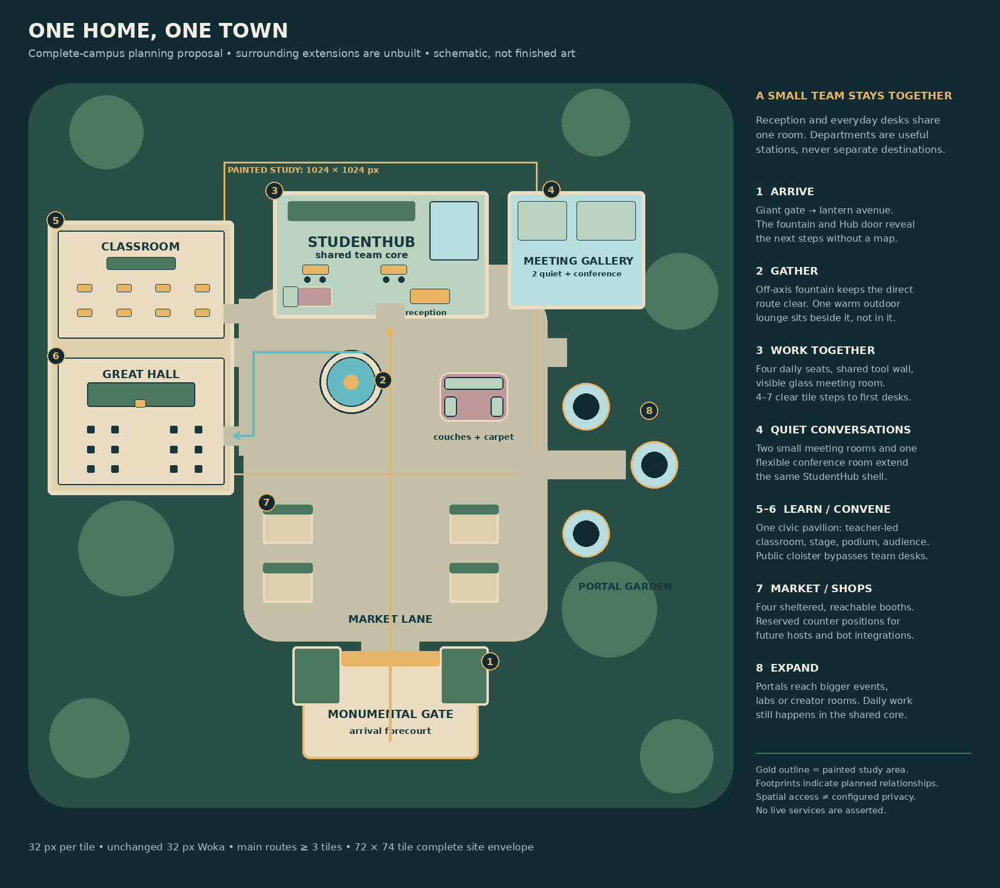

# Connected campus · full-layout schematic 01

## Status

**Unbuilt spatial proposal, not a playable map or finished art.** This is the exact delivered whole-campus overview. It places the painted arrival/workplace study within a larger connected plan; surrounding extensions are proposed, not constructed. There is no TMJ or play link.

The shared workplace has four daily work chairs in the current first slice. The diagram's silhouettes and distances communicate relationships, not pixel-exact painting bounds or tested collision clearances.

## Preserved sources

- [Delivered PNG](./01-connected-campus-concept.png) and [editable SVG](./01-connected-campus-concept.svg)
- [Spatial proposal](./SPATIAL-PROPOSAL.md): program, routes, future extensions and acceptance limits
- `source/render_layout.py`: original code-native renderer with only its output path made portable
- [Superseded six-seat study](./history/superseded-six-seat-study/README.md): earlier PNG/SVG retained as history, never presented as current

With Pillow 12.3.0 and the standard Linux DejaVu Sans font files, run `python3 source/render_layout.py`. It writes to `source/generated/`. The renderer produces both the current full-campus overview and the earlier six-seat sizing study; only the first is the current proposal. Editable SVGs can also be opened independently without this renderer.

## Limits

Public/quiet paths and room labels do not enable meetings, audio privacy, account permissions, bots, broadcasts, commerce or integrations. Those require separate implementation and real-client acceptance. Classrooms, events, market and portal extensions remain unbuilt.

See `PROVENANCE.md`, `template.json` and `SHA256SUMS.txt`.
