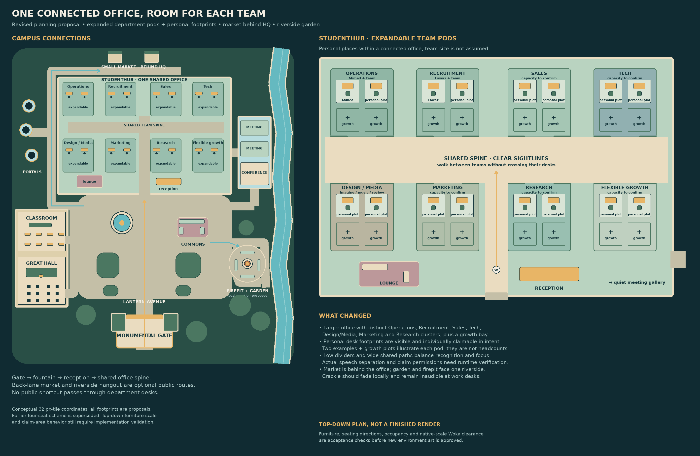

# Connected campus · expanded seven-team plan 03

Status: **unbuilt-spatial-proposal**. Not a deployed or catalog-ready map.

- Planning schematic for seven team clusters, public paths, riverside garden and market behind HQ. Geometry is a proposal, not a collision-verified built campus.
- Previous riverside layout 02 PNG/SVG is retained as a discrete planning revision within source.
- No live claims, social isolation, meeting services, bot or commerce integrations are configured by this diagram.
- Rendering scripts retain historical dependencies and may need path adaptation; editable SVGs and delivered PNGs are preserved unchanged.

## Preserved sources

Editable project sources and representative evidence are under `source/`. Original file hashes are recorded in `template.json`; archived hashes are in `SHA256SUMS.txt`. Text-only machine-path normalization is listed in `ARCHIVE-CHANGES.json`. The screenshot and binary art are unchanged. Historical evidence is retained as evidence of the original bounded test, not proof that the complete campus or current runtime passes.

See [provenance](./PROVENANCE.md).
