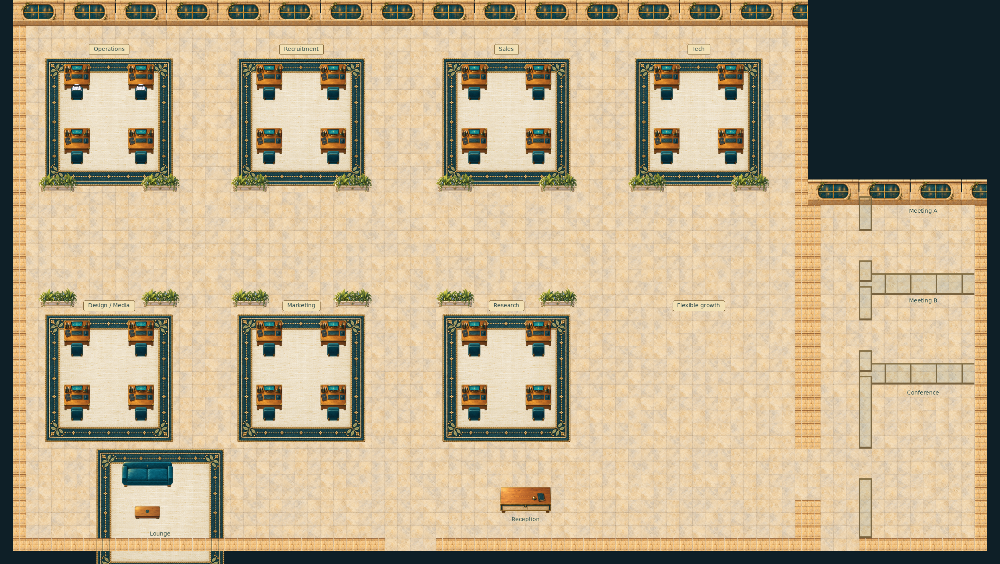

# Expanded office · rejected grid baseline 01

Status: **rejected-grid-direction-preserved**. Not a deployed or catalog-ready map.

- Frozen historical composition and its compositor are preserved unchanged except machine-path normalization. Dependent materials/geometry were not part of this original freeze; exact historical regeneration is not claimed.
- The earlier grid-baseline direction was rejected; the later connected office visual direction was liked. Neither status is full functional approval.
- Source render only, not multiplayer or live Universe. Seven named team clusters are provisional capacity, not assigned headcounts.
- A later source-harness clip has reported wall overlap and top-left chair egress crossing a neighboring conversation bubble. These known issues must be fixed and reverified before calling the office functional.

## Preserved sources

Editable project sources and representative evidence are under `source/`. Original file hashes are recorded in `template.json`; archived hashes are in `SHA256SUMS.txt`. Text-only machine-path normalization is listed in `ARCHIVE-CHANGES.json`. The screenshot and binary art are unchanged. Historical evidence is retained as evidence of the original bounded test, not proof that the complete campus or current runtime passes.

See [provenance](./PROVENANCE.md).
