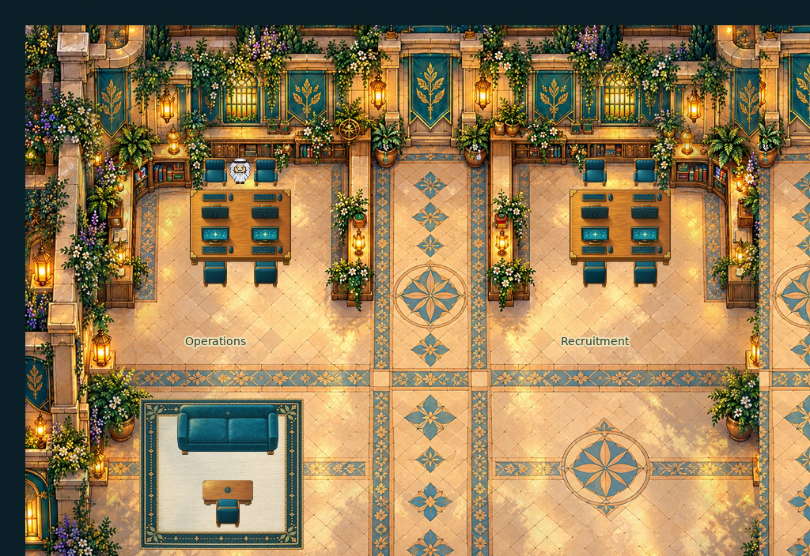

# Expanded office · source-harness revision 03

Status: **liked-visual-direction-known-egress-defects**. Not a deployed or catalog-ready map.

- Visual direction was liked. The delivered local Phaser clip has user-reported wall overlap and a top-left chair exit crossing a neighboring conversation bubble. This snapshot preserves those known issues and is not fully functional or socially safe egress acceptance.
- Historical 54-destination/91-assertion source-harness results are bounded technical evidence. Their checks did not establish live Universe, multiplayer, bubble isolation, claiming or service integration.
- Frozen source and native layers, compiled TMJ, selected runtime evidence and exact delivered WebM/MP4 are retained. Historical source paths may require sibling project inputs; no exact end-to-end rebuild claim.
- Revision02 review images are independently preserved in expanded-office-02. Revision03 runtime geometry and art adjustments must not be mistaken for exact revision02 source dependencies.

## Preserved sources

Editable project sources and representative evidence are under `source/`. Original file hashes are recorded in `template.json`; archived hashes are in `SHA256SUMS.txt`. Text-only machine-path normalization is listed in `ARCHIVE-CHANGES.json`. The screenshot and binary art are unchanged. Historical evidence is retained as evidence of the original bounded test, not proof that the complete campus or current runtime passes.

See [provenance](./PROVENANCE.md).

## Archive selection

The historical runtime README references DELIVERY.json, the full capture set and trial runs. This archive curates the final WebM/MP4, one representative frame, structured route/pixel results and source, omitting duplicate full/tight captures, transient delivery metadata and failed trial recordings. Those historical references do not imply every output is present.
