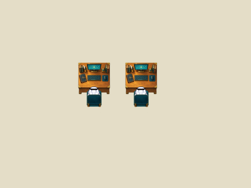

# Native team workstation · calibration 01

Status: **bounded-native-calibration-preserved**. Not a deployed or catalog-ready map.

- Two-station native geometry study; neutral floor is calibration, not finished office design. Failed first registration attempt is retained under source/art-source.
- Historical Phaser source-harness evidence does not prove live Universe, multiplayer, claiming, social proximity or complete office clearance.
- Existing 32px avatar is unchanged. Chair occlusion uses standing frames, not a new sitting animation.
- Later expanded-office wall overlap and top-left chair exit crossing a neighboring conversation bubble are known open issues; this fixture is not proof those issues are fixed.

## Preserved sources

Editable project sources and representative evidence are under `source/`. Original file hashes are recorded in `template.json`; archived hashes are in `SHA256SUMS.txt`. Text-only machine-path normalization is listed in `ARCHIVE-CHANGES.json`. The screenshot and binary art are unchanged. Historical evidence is retained as evidence of the original bounded test, not proof that the complete campus or current runtime passes.

See [provenance](./PROVENANCE.md).

## Archive selection

Historical source QA notes reference additional magnified/tight captures and WebM recordings. Those duplicate views and videos are omitted from this curated archive; native representative captures, structured results and harness sources are retained. Historical filenames are not promises that all test output files are included.
