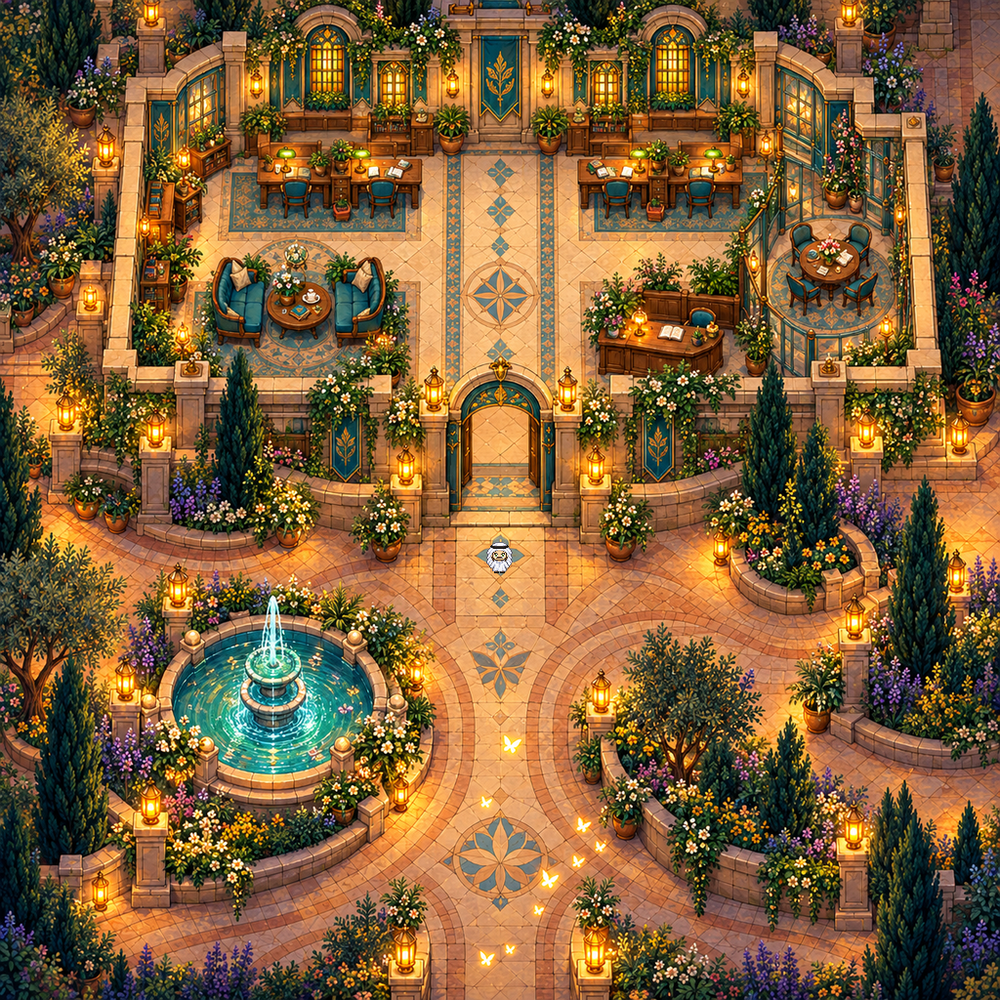

# Painted arrival · initial direction 01

## Status

**Unaccepted art experiment.** The layout and palette were liked, but the painted perspective and furniture usability were rejected as the main map direction on 2026-10-09. This remains useful source material for comparison. Its four-chair footprint was also superseded by a request for a larger interior with seven team clusters and claimable desk footprints; that later brief is not implemented here. Technical route evidence does not imply visual approval.

Frozen initial painted art direction. **Not a playable map.** This is the exact first delivered 1024 × 1024 still, retained for comparison and iteration. It has no TMJ, validated collision, final independent layers, roof behavior, gameplay walkthrough, animation or audible behavior.

The actual painting has **four daily work chairs** in two close desk pairs. Meeting-room seating is separate. The historical generation prompt requested six positions; it is preserved unchanged as source provenance and must not be treated as the current seat count or an instruction for later work.

## Editable sources

- `source/master-1254.png`: original 1254 × 1254 image-generation master, unchanged
- `source/generation-prompt.txt`: exact historical generation prompt
- `source/greg-scale-reference.png`: unchanged existing avatar sheet used only for the 32 × 32 scale composite
- `tools/rebuild_preview.py`: reduces the master once to 1024 × 1024 and composites the existing avatar frame at (496, 555)

With Pillow 12.3.0, run `python3 tools/rebuild_preview.py`. It writes `rebuild/preview-1024.png` without overwriting the frozen screenshot. Rebuilt preview bytes match the delivered file. The master is editable raster artwork, not a layered gameplay map.

## Known open issue and version boundary

Doorway, glass and threshold readability still require a separate visual correction and later collision/occlusion verification. A door-fix revision belongs in its own snapshot folder. The first still and its prompt stay unchanged, including any imperfections. Active layer extraction, runtime and audio experiments are intentionally excluded because they were not part of this frozen delivery.

See `PROVENANCE.md`, `template.json` and `SHA256SUMS.txt`.
