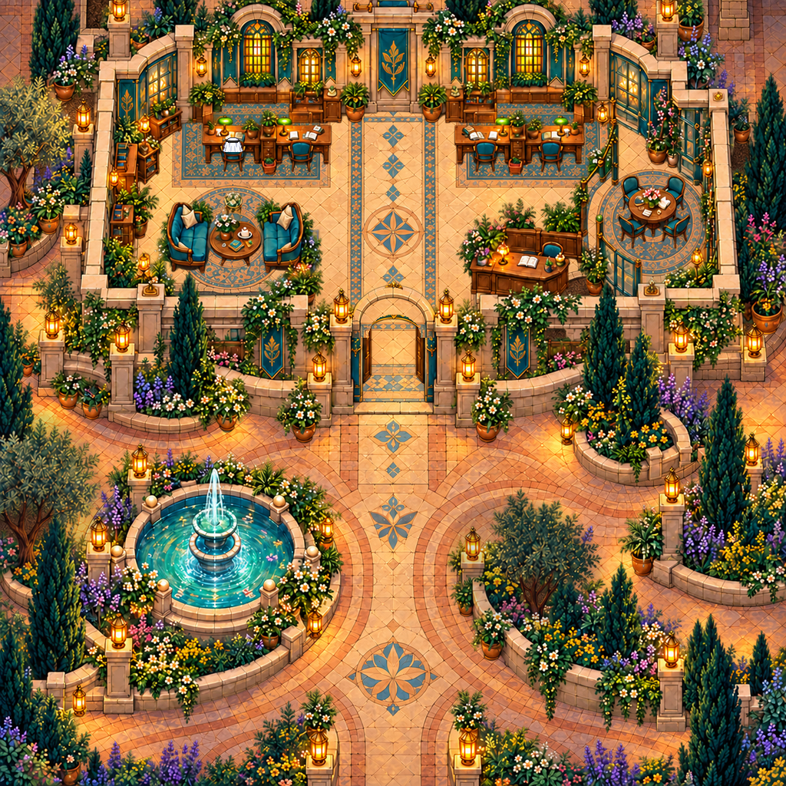

# Painted arrival · open glass doorway 02

## Status

**Unaccepted art experiment.** The layout and palette were liked, but the painted perspective and furniture usability were rejected as the main map direction on 2026-10-09. This remains useful source material for comparison. Its four-chair footprint was also superseded by a request for a larger interior with seven team clusters and claimable desk footprints; that later brief is not implemented here. Technical route evidence does not imply visual approval.

**Frozen layered-art source snapshot. Browser validation was pending at the time of this snapshot.** This preview is an offline compiler composite, not a gameplay screenshot. No TMJ or play link is included here, and no user acceptance or full Universe validation is implied.

The west glass-room doorway is opened while the connected workplace/court composition is retained. There are four daily work chairs. Snapshot 01 remains unchanged in its own folder.

## Preserved source

The `source/` folder contains the unchanged 1254px door-revision master, native art preview, layered-chair preview, clean ground receiver, alpha object plate, water-motion strip, semantic mask JSON and compiler source captured at freeze. `FROZEN-SNAPSHOT.json` records their original hashes and project-relative origins. Every frozen file is preserved byte-for-byte.

The exact later image-edit/pass prompt strings were not saved. `PROVENANCE.md` records the known edit intent without inventing those prompts.

## Compiler boundary

`source/compile_painted_section.py` is preserved as historical project source, **not a standalone runnable command in this snapshot folder**. Its project-relative dependencies include the original directory structure, the unchanged scale sprite and an audio-layout integration input that was not included in the freeze. The separately finalized runtime package will identify its own tested source/dependency set. Do not infer gameplay or regeneration acceptance from this reference script.

The clean ground and alpha plate remain directly editable raster sources; the semantic polygons remain editable JSON. No live scripts, audio adapter or unfinished runtime dependency bundle is copied into this frozen-art record.

See `template.json` and `SHA256SUMS.txt`.
