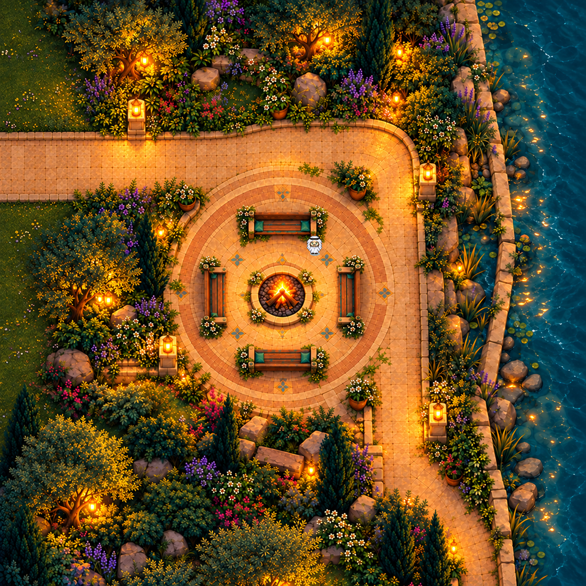

# Riverside garden · native review module 01

Status: **liked-art-superseded-demo-preserved**. Not a deployed or catalog-ready map.

- Riverside visual direction was liked. Preserves selected garden source plus two prior generated attempts, native layers, geometry, audio adapter and bounded evidence.
- Original garden TMJ and native integration TMJ are historical source artifacts; full host integration, multiplayer, social egress, physical devices and actual audio listening remain unverified.
- Bench proofs use existing standing frames at seat positions, not new sitting animation. Low local sound never establishes conversation privacy.
- No live portal, ownership, native meetings or catalog selection is enabled.

## Preserved sources

Editable project sources and representative evidence are under `source/`. Original file hashes are recorded in `template.json`; archived hashes are in `SHA256SUMS.txt`. Text-only machine-path normalization is listed in `ARCHIVE-CHANGES.json`. The screenshot and binary art are unchanged. Historical evidence is retained as evidence of the original bounded test, not proof that the complete campus or current runtime passes.

See [provenance](./PROVENANCE.md).

## Superseded runtime boundary

The root candidate uses a superseded conditional demo and is not portable host behavior. The newer `source/native-integration/` static variant has separate source and geometry; its final readiness is unconfirmed. Preserve both as historical candidates, not functioning live integrations. Visual approval applies to the artwork only.
