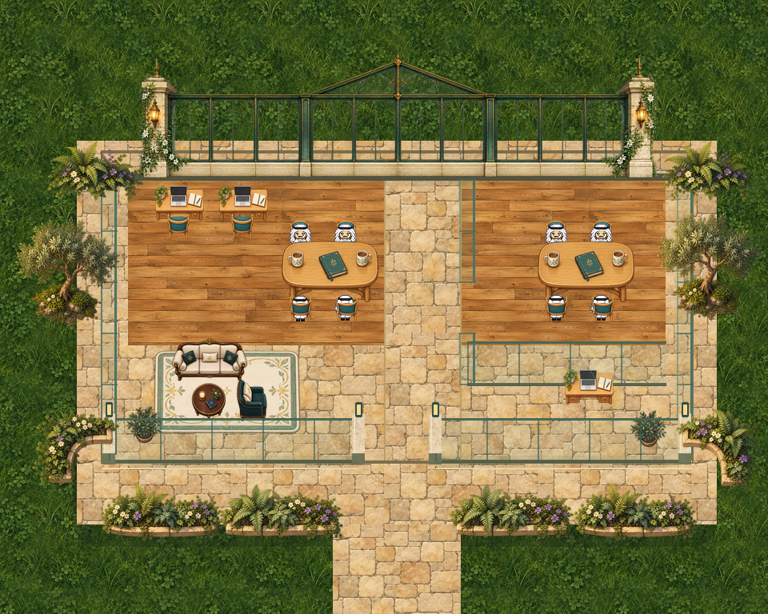

# Social Room / Outdoor Office · native32



Separate derivative of the approved roofless office/hangout direction. This is not the magical main map. It remains a review candidate under map-mocks, outside the published build and live template catalog.

Open `map/studenthub-outdoor-office.tmj` with its relative tileset intact. Native world size960×768;32px tiles and unchanged32px avatar. No scripts, WAM meeting registration, ambient audio, external room links, forced interaction or generic silent property.

## Stacked review dependency

This regular PR targets `archive/map-mock-library-2026-10-09` and depends on [PR #3](https://github.com/BAWES-Universe/universe-maps/pull/3). That base excludes map-mocks from publication discovery. Runtime assets are self-contained; the template is not live. No Pages or master build configuration is changed here.

## Changes

- Fix three missing area visibility booleans.
- Move four near-side chairs down8px into reachable floor, preserving their source pixels.
- Separate original backrest/tabletop pixels into foreground so occupants retain visible heads.
- Author eight table positions and clear entry/exit routes; no sitting animation or seat lock.
- Preserve every one of the original720 permanent collision cells, including both full table blockers.

## Rebuild

Requires Python3, Pillow and Git. Source artwork is pinned to the separate archive commit below, which need not be merged into your current branch. The runtime TMJ/atlas are self-contained. Retrieve source inputs explicitly:

```sh
git clone --filter=blob:none --no-checkout https://github.com/BAWES-Universe/universe-maps.git /tmp/universe-office-source
git -C /tmp/universe-office-source sparse-checkout set map-mocks/studenthub-roofless-outdoor-office
git -C /tmp/universe-office-source fetch origin 03d83f2dd74108a6f75847bd2f7d03c5d619c950
git -C /tmp/universe-office-source checkout --detach 03d83f2dd74108a6f75847bd2f7d03c5d619c950
export OUTDOOR_OFFICE_SOURCE=/tmp/universe-office-source/map-mocks/studenthub-roofless-outdoor-office
```

Then, from this derivative folder:

```sh
python3 source/build_template.py
python3 source/verify_art.py
python3 source/verify_geometry.py
sha256sum -c SHA256SUMS.txt
```

Rebuild reads OUTDOOR_OFFICE_SOURCE and verifies every input against source/inputs.json before compiling. It writes only this derivative. It does not assume a sibling archive exists on master; original archive files are neither edited nor duplicated here. Generated intermediate layers/reports stay in ignored source/generated. The runtime map needs only its TMJ and one native32 atlas.

## Evidence and limits

- 8/8 actual Phaser3.86 approaches/exits passed with the other seven seats occupied by solid16px body fixtures.
- 16/16 source-derived native touch-handler/EasyStar/Player approaches/exits passed in real Phaser with immovable=false and pinned default speed9 (180px/s), with zero attempted or resolved body overlaps.
- Exact native atlas roundtrips and foreground split passed. Each authored head's top10px remains clear.

See validation/RESULTS.md for exact scope, source revision and reproducibility. Preview is a fresh standalone browser capture; seven avatars are stationary test fixtures, not live multiplayer. Desk/lounge chairs are decorative and are not advertised as authored seats. Native direct taps were tested single-player; separate occupied-body routes establish available clear paths, not automatic routing around live users.

Full Universe import/build, live proximity conversation and physical-device acceptance are unrun. This PR does not publish or activate the map.

Preserve ART-PROVENANCE.md. No new paid assets/generation were used; source rights remain unchanged.
