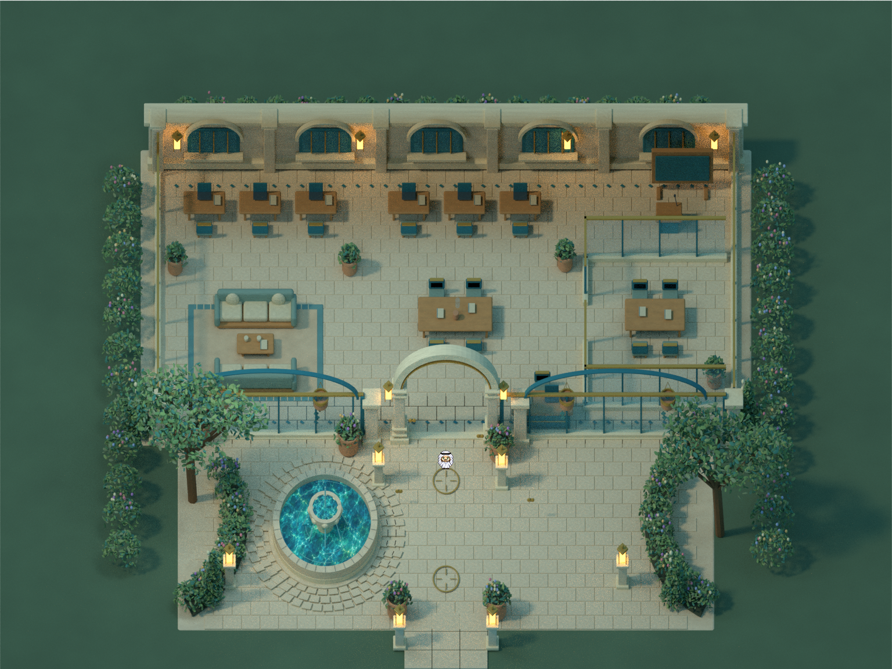

# StudentHub arrival · art and lighting study

## Status

**Rejected main-world art study. Not a playable map or catalog-ready template.** This preserves the final bounded lighting/material experiment and its earlier brown maquette without replacing any existing map. No TMJ, gameplay atlas or play link exists for this study.

The images are offline Blender renders at native resolution with the unchanged avatar used only for scale. They are not browser screenshots or evidence of multiplayer behavior.

## Preserved work

- [Open interior](./docs/final-open-native.png), [covered roof](./docs/final-covered-native.png), and [native threshold detail](./docs/final-threshold-native.png)
- [Packed final Blender source](./art-source/studenthub-arrival.blend), original material PNGs and [scene layout](./art-source/scene-layout.json)
- [Earlier brown maquette](./experiments/brown-maquette/README.md), with its own packed scene and preview
- [Look-development diagnosis](./docs/LOOK-DEVELOPMENT-STATUS.md), [proposed next art step](./docs/NEXT-ART-STEP.md), and [asset provenance](./art-source/PROVENANCE.md)
- Original `tools/build_scene.py`, `tools/pack_scene.py` and `SOURCE-README.md`

The proposed next step is retained as a design note only. It does not authorize or claim further art production.

## Open or rebuild

Open either `.blend` file with Blender 4.3.2. Both files pack all their required material images, and external material copies are included. From this folder, `blender -b -t 12 --python tools/build_scene.py -- --draft` rebuilds the final scene and draft renders. It writes new outputs; make a copy before iterating. It is not an exact regeneration recipe for the final avatar-composited review images.

Resource and output paths in the archive copies were made relative and cached environment paths removed. The source files were reopened successfully after this portability-only change; object, mesh and material counts and every packed-image hash remain unchanged. Original source hashes are recorded in `template.json`; archived file hashes are in `SHA256SUMS.txt`.

## Verification boundary

Final images remain byte-for-byte identical to the delivered study. Open/covered views are 1536 × 1152 pixels; threshold detail is 768 × 480. Both packed sources reopen in Blender, use only local material references, and contain no external libraries or embedded scripts. See [Blender validation](./docs/BLENDER-ARCHIVE-VALIDATION.json).

No TMJ export, physics, collision, seating, glass/lectern behavior, mobile input, water animation, sound or live service integration was validated. Prepared compiler/harness code, dependency bundles, logs, backup `.blend1` files and interim renders are intentionally excluded.
