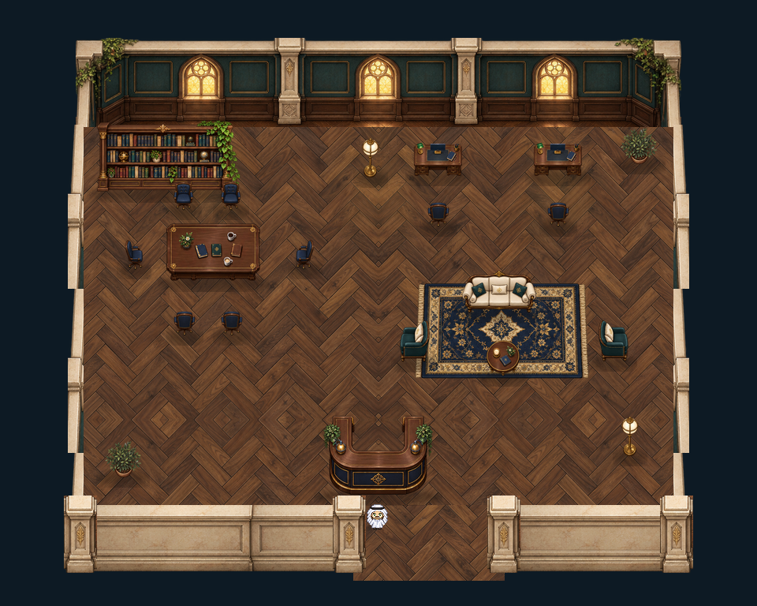

# StudentHub · refined dark composition

## Status

visual-only-preserved. Static visual proposal only; there is no importable TMJ for this design. This folder is retained for future template selection and iteration. It is excluded from the published build.

## Source and evidence

Canonical snapshot: Historical campus interior compositor refined_prototype.py. `template.json` records the map hash, screenshot, status and reuse limits; `SHA256SUMS.txt` checks every archived file. Screenshots are historical rendered evidence, not a claim of current live deployment.

## Known limitations

- Archived review candidate; not added to the live template catalog by this change.
- Historical source-harness evidence is not full Universe, current engine, multiplayer or physical-device acceptance.
- Imported static furniture does not imply movable editor entities or sitting behavior. Review native meetings, permissions, interactions and hosting before reuse.
- No TMJ was authored for this isolated proposal. Included Python compositor and layer outputs support visual iteration only.

## Reuse

Start from a copy of this folder. Keep the original snapshot unchanged, and create a new named folder for a revision. Re-test local asset references, collisions, entry/exit, avatar depth, conversation/audio behavior and engine compatibility before promoting it into the template catalog. Existing source art provenance and licenses remain with the map assets when available.

## Rebuild visual

From `source/`, install Pillow and run `python3 tools/refined_prototype.py`. Linux DejaVu Sans is required by the first composition. The generated historical layer images live in `source/evidence/`.
