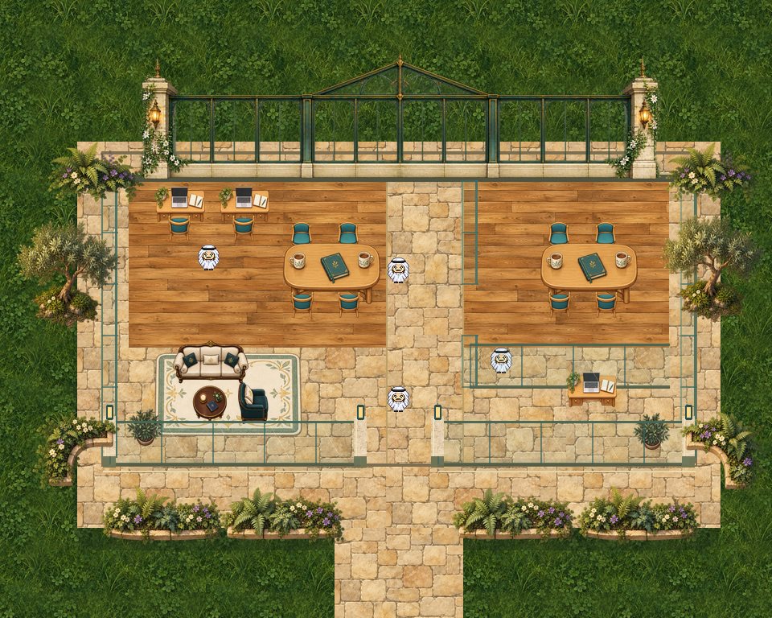

# StudentHub · roofless outdoor office

## Status

future-template-candidate. Editable Tiled source and referenced assets are under `map/`. Keep the complete folder together when opening or copying it. Open `map/studenthub-outdoor-office.tmj` in Tiled. This folder is retained for future template selection and iteration. It is excluded from the published build.

## Source and evidence

Canonical snapshot: Separate roofless derivative of the connected StudentHub proof, 2026-10-09. `template.json` records the map hash, screenshot, status and reuse limits; `SHA256SUMS.txt` checks every archived file. Screenshots are historical rendered evidence, not a claim of current live deployment.

## Known limitations

- BUILD/IMPORT LIMIT: the pinned repository Tiled schema validator rejects three area objects because their visible booleans are omitted. Original TMJ bytes are preserved; add explicit object visibility in a separately named, tested derivative before publishing with this repository build.
- Archived review candidate; not added to the live template catalog by this change.
- Historical source-harness evidence is not full Universe, current engine, multiplayer or physical-device acceptance.
- Imported static furniture does not imply movable editor entities or sitting behavior. Review native meetings, permissions, interactions and hosting before reuse.
- Rejected as the main Universe art direction; preserved specifically for a future small outdoor office, world room or hangout.
- This derivative removes the roof, reveal script and unintended generic silent property; its collision footprint is unchanged.
- The screenshot is the native authored composition with repeated unchanged avatars for scale, not a multiplayer session. No full Universe or physical-device acceptance was performed.

## Reuse

Start from a copy of this folder. Keep the original snapshot unchanged, and create a new named folder for a revision. Re-test local asset references, collisions, entry/exit, avatar depth, conversation/audio behavior and engine compatibility before promoting it into the template catalog. Existing source art provenance and licenses remain with the map assets when available.

## Rebuild source

From `source/`, install Pillow and run `python3 tools/build_template.py`. This rebuilds a new `source/map/` and `source/docs/outdoor-native.png`; the canonical archived `map/` and screenshot stay unchanged.
